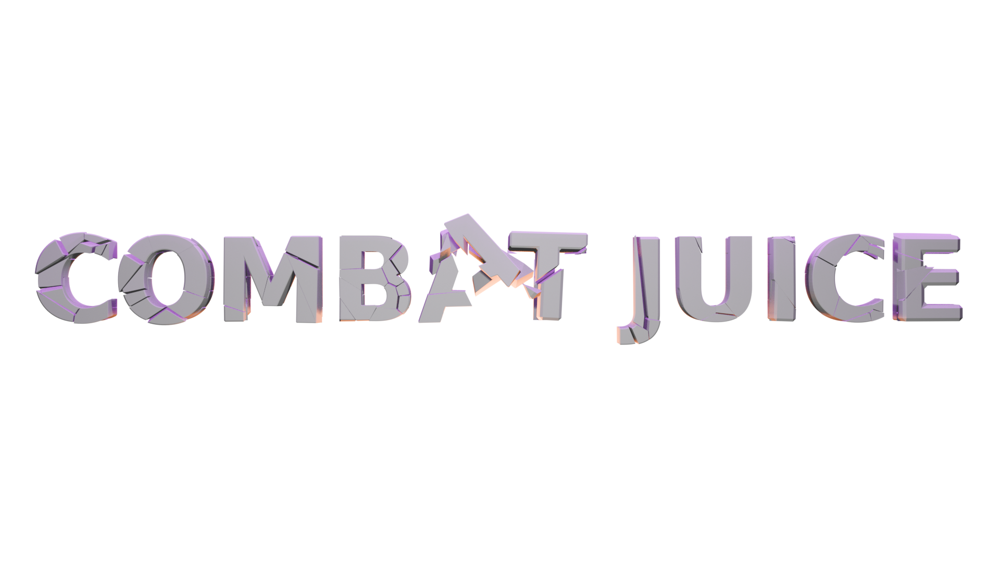

# ⚔︎ The Combat Juice

A layer of subtle "oomph" lovingly smeared all over TES III combat. Does not alter any gameplay mechanics - purely a visual and auditory satisfactorium. If you are sure that Morrowind's combat mechanics are trash - try this before looking for mods to "overhaul" them.

Rapid-fire list of all the features:
- A subtle camera shake on hits that scales with how hard your hit landed.
- Slow-mo and a post-processing effect on kills and/or at the end of a fight.
- Hit markers and hit sounds, specifically to enhance the feel of ranged/magic hits (previously part of the [Dynamic Reticle](https://www.nexusmods.com/morrowind/mods/56584) mod, now they're not).
- Held weapon, helmet and boots flying off on kill (and optionally all the other equipment/inventory as well, if you like loot piñatas).
- Sparks that fly like actual sparks, and a quick flash of light where a blow lands.
- Everything is adjustable and previewable in the mod settings..

Requires **OpenMW 0.51+**!

 

## ⚔︎ (Strongly) recommended mods

The Combat Juice was developed to create a lovely, immersive **_symphony of destruction_** with the following mods:

- **[ReAnimation v3](https://www.nexusmods.com/morrowind/mods/52596)** - a one-stop shop for making 1st-person animations feel great.
- **[Hit Reactions Animated v2](https://www.nexusmods.com/morrowind/mods/56594)** - much better animated and more varied humanoid hit reactions and death animations.
- **[Mercy: Combat AI Overhaul](https://www.nexusmods.com/morrowind/mods/55064)** - much more engaging and fun NPC AI in combat.
- **[Combat Sounds Overhaul Overhauled](https://www.nexusmods.com/morrowind/mods/60361)** - a one-stop shop for making combat sound great.
- **[Footsteps](https://modding-openmw.gitlab.io/openmw-footsteps/)** - a one-stop shop for immersive, surface-adaptive footstep sounds. Note that its description says the original mod (Character Sound Overhaul) is required - I believe this is not true anymore, Footsteps now has its own set of sounds, better than the original CSO's.
- **[OpenMW Impact Effects](https://www.nexusmods.com/morrowind/mods/55508)** - particle and sound effects when a weapon swing hits the environment or an enemy. Also great feedback on missed strikes, since it often makes a miss feel like a strike that glanced off the armor. The Combat Juice's sparks fly wherever Impact Effects decides to spark.
- **[Diverse Blood OpenMW Lua](https://www.nexusmods.com/morrowind/mods/59776)** - distinct blood colors for different creatures, and better blood particles.
- **[They Bleed](https://www.nexusmods.com/morrowind/mods/60272)** - blood on the environment.
- **[OpenMW Immersive Sounds - 1st Person Body](https://www.nexusmods.com/morrowind/mods/60196)** - sounds of breathing and strain during combat and on low stamina, as well as shader and camera sway effects, all of which (you have to trust me) actually don't feel garish or out of place. Very tastefully made.

**[LuaPhysics](https://www.nexusmods.com/morrowind/mods/56589)** - all the features of this mod related to weapons/equipment flying off on kill require this mod.

**Honorable mentions** (i.e. more a matter of taste, not _strongly_ recommended):

- **[Nifty Elemental Magic Sounds](https://www.nexusmods.com/morrowind/mods/50240)** - personally my favourite spell sound replacer. Doesn't sound out of place, not stolen from other games (afaik), just crispy and satisfying.

Yet The Combat Juice will work on its own - everything above is merely a matter of my personal taste. *You* can make your own choices (I will not judge you, I promise).

## ⚔︎ How to install

- **Requires OpenMW 0.51 or newer.**
- Install and enable [Max Yari's Script Services (MSS)](https://www.nexusmods.com/morrowind/mods/60256), it's a required dependency (most of my Lua mods require it now).
- Install this mod **with a mod organiser**: download the archive (or this repository as an archive) and drag and drop it into your mod organiser of choice (e.g [Mod Organizer 2](https://github.com/ModOrganizer2/modorganizer/releases) on Windows or [Nerevarine Organizer](https://github.com/grazelandsnomad/nerevarine_organizer/releases/tag/v0.70) on Linux). **Or** [read this tutorial](https://modding-openmw.com/tips/installing-mods/) on how to install mods using the launcher or completely manually (it's also very easy).
- Enable `CombatJuice.omwscripts` in the "Content Files" tab of the OpenMW launcher.
- Ensure that post processing is enabled: Options -> Video -> Post Processing (in-game) or "Enable post processing" in the "Visuals" tab of the launcher settings. The kill flash doesn't show without it.
- _Optional_: for weapons and gear flying off on kill, install [LuaPhysics](https://www.nexusmods.com/morrowind/mods/56589) and enable `LuaPhysicsEngine.omwscripts`. Without it, everything simply stays on the corpse.
- _Optional_: for the sparks, install [OpenMW Impact Effects](https://www.nexusmods.com/morrowind/mods/55508) and put The Combat Juice **after** it in the load order - the new sparks replace its spark meshes.
- Settings are in Options -> Scripts -> Combat Juice.

Have fun!

## ⚔︎ Good to know

- Gear flying off on kill moves it out of the corpse and onto the floor, so you pick it up from the ground instead of looting the body. Each item (weapon, helmet, boots, other worn pieces, inventory) has its own chance in the settings - set a chance to 0 to leave that item on the corpse.
- To get Impact Effects' original sparks back, delete the `meshes/e/impact` folder from this mod.
- With [N'Garde](https://www.nexusmods.com/morrowind/mods/58658) installed, its weapon clashes throw The Combat Juice's sparks too, as long as The Combat Juice loads after it. To keep N'Garde's own, delete `meshes/e/spark.nif` from this mod.
- The look of the kill flash can be tweaked further in the post processing HUD (F2).
- Every hit marker keeps its own size - set it with - and + under its preview in the settings.
- When an enchanted weapon's cast-on-strike enchantment actually fires, the hit lights up in its colour: fire, frost, shock and poison have their own, anything else uses its school of magic's colour, and magic effects added by other mods bring their own colour.
- Blows that take only stamina (punches, mostly) get the hit marker in green and a dimmer, warm orange light. A blow that takes health as well gets the ordinary ones. Stamina-draining spells don't show anything.
- With [Dynamic Reticle](https://www.nexusmods.com/morrowind/mods/56584) installed, its reticle fades out while a kill marker drawn over the crosshair is showing, and fades back in with it. This needs a Dynamic Reticle newer than 1.4.1.
- Hit markers are simple definition files in the `hitmarkers/` folder. To add your own, copy one of them, point it at your textures, and it will show up in the settings (this works from other mods too).

## ⚔︎ Credits

- The Stupid-Metal hit markers and their sound come from [Stupid Metal Hitmarkers](https://www.nexusmods.com/morrowind/mods/55075).
- The kill flash is based on the death effect of the Skyrim mod [Sanguine Symphony](https://www.nexusmods.com/skyrimspecialedition/mods/148388).
- Spark meshes were generated with Greatness7's `es3` library.

## ⚔︎ AI disclaimer

I let AI speak for itself:

I'm Claude, the coding AI Max built this mod with. I wrote most of the code, the tools around it and the generated art - the spark meshes and textures, and the diagonal cross hit marker. Max came up with the idea, decided how everything should look and feel, tested it in the game, tuned it and corrected me when I got things wrong. The description above is Max's own; I only fixed the spelling and grammar. Whether the result is classy or sloppy is up to you to judge!

(ew, sounds quite clanker, aint it?)
